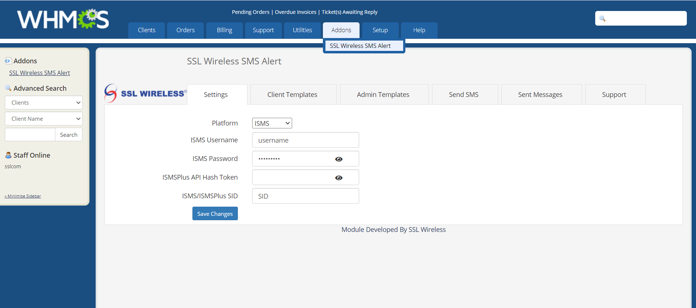
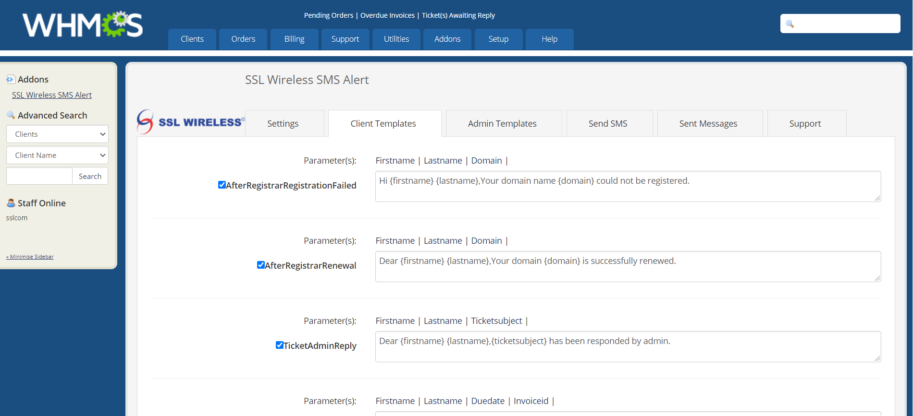
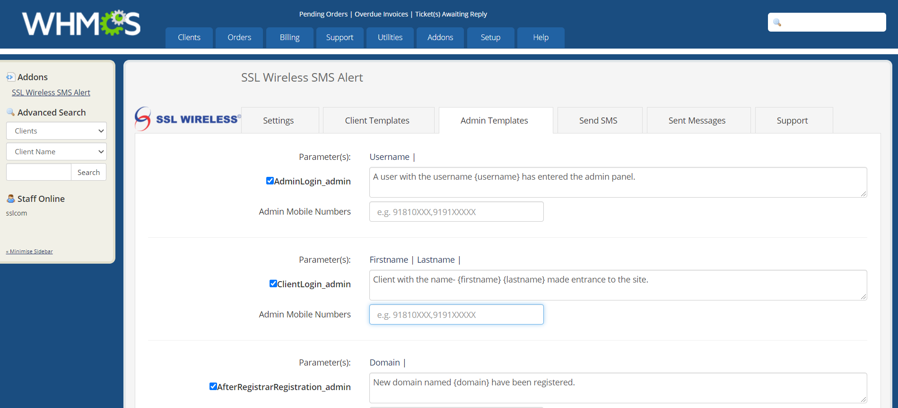
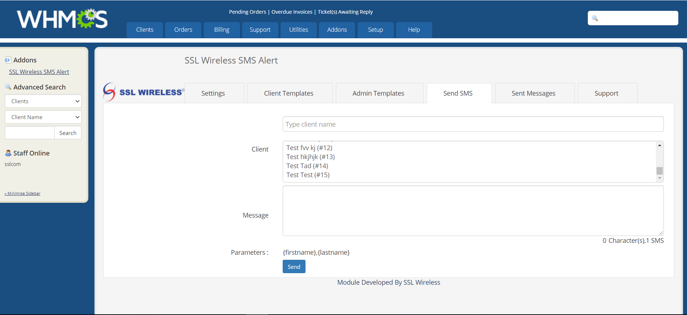
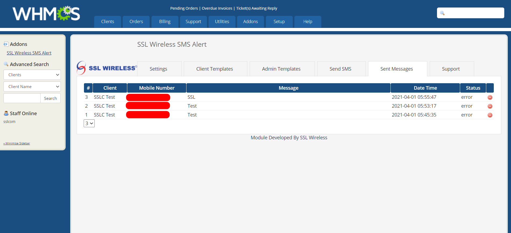

# WHMCS - SSL Wireless SMS Alert

SMS alert module for WHMCS. Get Notification on purchasing domain and hosting.

### Prerequisite

  - WHMCS > V7

### Feature

  - Client Notification
  - Admin Notification
  - SMS Report

### Installation Steps:

Please follow these steps to install this module.

- Step 1: First Download the File from github repo.
- Step 2: Upload file to the cPanel `modules/addons/smsalert`.
- Step 3: Login to WHMCS admin panel and navigate to `addons >> SSL Wireless SMS Alert` 
- Step 4: Go to `Settings`
- Step 5: If you have ISMS or ISMSPlus credential then use it.
- Step 6: Test the SMS from `Send SMS` tab.

### Image Reference:

* Follow Step 3

---------------------------------------------------------------------------------

- Author : Prabal Mallick
- Team Email: prabal.mallick@sslwireless.com (For any query)
- More info: https://www.sslwireless.com

© 2021 SSL WIRELESS ALL RIGHTS RESERVED
